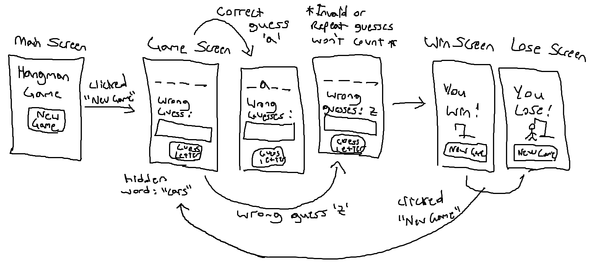
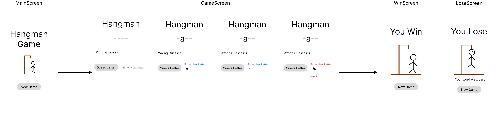

# Hangman Game Project

The purpose of this project is to practice working with Behaviour-Driven Development (BDD), Test-Driven Development (TDD) and Continuous Integration (CI).

### Before You Start

Before you start writing any code, remember you will be graded based on your development process and **NOT** just the finished outcome. Make sure to read through this README to have a good understanding of how to complete this project. To avoid losing any points, make sure you follow the rules below.

**Rules:**

- Do **NOT** commit & push directly into the master/main branch.
- Do **NOT** merge broken code into the master/main branch. (*You can still commit & push to your other branches*)
- Do **NOT** merge into the master/main branch without a pull request.
- Do **NOT** merge into the master/main branch without filling out your `pull_request_template.md` file.

<br>

## Design & Planning (Validation)

This phase utilizes <span style="color: #0096FF">**Behaviour-Driven Development (BDD)**</span> to determine the application's behaviour and fucntionality from the customer's request. For this phase you do not need to add any material, simply read through it to understand the behaviour of this application.

**Customer Request:**

*"I want a mobile app for users to play the classic hangman game. The game should show the user x amount of underscores so they know the length of the word. The user should only be allowed 7 wrong guesses for pole, head, body, arms (x2), and legs(x2) and they should be shown their wrong guesses. If they guess all the right letters before the complete figure is drawn, they win!"*

Upon hearing their request you draft the following user stories.

### User Stories

- As a player, I should see a row of dashes equal to the hidden word’s length, so that I know how many letters to guess.

- As a player, I should be able to input a single letter, so that I can progress the game and reveal the hidden word.

- As a player, I should see a list of my incorrect guesses, so that I can avoid repeating the same letter.

- As a player, I should not be allowed to input numbers, special characters, nor previous guesses, so that I don't lose a turn.

- As a player, I should be taken to a lose screen where the hidden word revealed after 7 wrong guesses, so that I know I have lost the game.

- As a player, I should be taken to a win screen after correctly guessing the hidden word, so that I know I have won the game.

- As a player, I should have the option to start a new game after being taken to a win or lose screen, so that I can play again.


Using the above user stories, you draft multiple validation sketches and finally the customer agrees to the sketch below.

### Validation Sketch



Messy isn't it? You decide the above validation sketch isn't good enough to serve as your guide, so you quickly draft the low-fidelity prototype below.

### LoFi Prototype



This prototype is much nicer! Use this Figma lofi prototype to serve as your guide for building the application.

<br>

## Testing (Verification)

This phase utilizes <span style="color: #0096FF">**Test-Driven-Development (TDD)**</span> where we develop our tests first based on our validation sketch and lofi prototype then afterwards write code to pass those tests and refactor if necessary.


From the prototypes in the validation phase above you create the following **Acceptance Criteria** in Gherkin style.

### Acceptance Criteria

<div style="color: #4F7942">

**Happy Paths:**

- **Given** I am on the Main Screen, **When** I click the "New Game" button, **Then** should be taken to the Game Screen.

<br>

- **Given** I am on the Game Screen, **When** I input a single letter ('a'-'z', 'A'-'Z') **And** the letter is in the hidden word **And** I click the "Guess Letter" button, **Then** I should see the letter within the underscores.
- **Given** I am on the Game Screen **And** I have guessed all letters but one, **When** I input a single letter ('a'-'z', 'A'-'Z') **And** the letter is in the hidden word **And** I click the "Guess Letter" button, **Then** I should be taken to the Win Screen.
- **Given** I am on the Win Screen, **When** I click the "New Game" button, **Then** I should be taken to the Game Screen.

<br>

- **Given** I am on the Game Screen, **When** I input a single letter ('a'-'z', 'A'-'Z') **And** the letter is NOT in the hidden word **And** I click the "Guess Letter" button, **Then** I should see the letter amongst my "Wrong Guesses:".
- **Given** I am on the Game Screen **And** I have used 6 of my wrong guesses, **When** I input a single letter ('a'-'z', 'A'-'Z') **And** the letter is NOT in the hidden word **And** I click the "Guess Letter" button, **Then** I should be taken to the Lose Screen.
- **Given** I am on the Lose Screen, **When** I click the "New Game" button, **Then** I should be taken to the Game Screen.
</div>

<br>

<div style="color: #D22B2B">

**Sad Paths:**

- **Given** I am on the Game Screen, **When** I input a special character (ex: '#','%',..) or number **And** I click the "Guess Letter" button, **Then** I should see an "invalid" message.
- **Given** I am on the Game Screen, **When** I input a more than one letter or character (ex: "abc", "aa") **And** I click the "Guess Letter" button, **Then** I should see an "invalid" message.
- **Given** I am on the Game Screen, **When** I input a previously used letter **And** I click the "Guess Letter" button, **Then** I should see an "already used that letter" message.
</div>

### Unit Tests

After creating your acceptance criteria, you decide to write your unit tests. **Unit tests** are tests that test individual functions rather than user interaction. You also decide to place all your game calculation functions inside a single dart file rather than having many functions spread throughout multiple dart files.

All your game functions will be inside a `HangmanGame` class located in the `lib/models/hangmangame.dart` file.

You create a set of tests in `test/unit_tests.dart` to test the following functions.

- A `guess()` function, that determines if a letter guess is *accepted* (has not been guessed before) or not by returning `true` or `false` or throws an `ArgumentError` if the guess is invalid.
- A `status()` function, that determines if the game is ongoing or completed by returning `'play'`, `'win'` or `'lose'`.
- A `correctGuesses()` function, to help us keep track of our correct guesses by returning them in a string (ex: `'abc'`).
- A `wrongGuesses()` function, to help us keep track of our incorrect guesses by returning them in a string (ex: `'def'`).
- A `blanksWithCorrectGuesses()` function, to help us organize our dashes and guessed letters.
- A `word()` function, to return the hidden word.

**Examples:**

Guessing a single correct letter from our hidden word.

```dart
    // pass in the secret word
    var game = HangmanGame('banana');

    bool wasAbleToMakeGuess = game.guess('b'); // returns true
    print(game.blanksWithCorrectGuesses()) // returns 'b-----'
    print(game.status()) //returns 'play' 
```

Guessing a single correct letter that appears multiple times in our hidden word.

```dart
    var game = HangmanGame('banana');

    print(game.blanksWithCorrectGuesses()) // returns '------'

    game.guess('b'); // returns true
    game.guess('n'); // returns true

    print(game.blanksWithCorrectGuesses()) // returns 'b-n-n-'
    print(game.correctGuesses()) // returns 'bn'
```

Guessing all the correct letters in our hidden word and winning the game.

```dart
    var game = HangmanGame('car');

    print(game.status()) // returns 'play'

    // returns true
    game.guess('c');
    game.guess('a');
    game.guess('r');

    print(game.correctGuesses()) // returns 'car'
    print(game.wrongGuesses()) // returns ''
    print(game.status()) // returns 'win'
```

Guessing a wrong letter, guessing the same letter multiple times, and guessing an invalid letter.

```dart
    var game = HangmanGame('car');

    game.guess('car'); // trhows ArgumentError
    game.guess('%'); // trhows ArgumentError

    game.guess('z'); // returns true

    game.guess('a'); // returns true
    game.guess('a'); // returns false 

    print(game.correctGuesses()) // returns 'a'
    print(game.wrongGuesses()) // returns 'z'
    print(game.status()) // returns 'play'
```

Use the following command to run the unit tests.

**Terminal:**

```console
flutter test test/unit_tests.dart
```

**In VS Code:**

1. Open the test/unit_tests.dart file
2. While in the test/unit_tests.dart file
3. Select the Debug menu
4. Click the Run Without Debuging option

### Integration Tests


Use the following command to run the integration tests.

**Terminal:**

```console
flutter test test/integration_tests.dart
```

**In VS Code:**

1. Open the test/integration_tests.dart file
2. While in the test/integration_tests.dart file
3. Select the Debug menu
4. Click the Run Without Debuging option

<br>

## Code Implementation

Now its time for you to start writing code!

Use <span style="color: #0096FF">**Continuous Integration (CI)**</span> when updating your GitHub repository. CI is one of the 2 phases of **DevOps** and it focuses on updating your source code in a way that almost 100% prevents Regression.


The first step of CI is to setup your **Configuration-as-Code (CaC)**, this step is where you configure your code repository to enforce the CI pipeline.

### Configuration-as-Code

This step has been partly setup for you. Your current repository already has a `.github/workflows/flutter_test.yaml` file that forces GitHub to run all of your tests when a Pull Request is made, and a `pull_request_template.md` file where you can put a description of your Pull Request.

The only thing that's missing is setting up a **Branch Protection Rule** that instructs GitHub not to allow any changes to the `main/master` branch unless it's through a Pull Request.

### Branching

You can create a new branch and update your GitHub repo all from your terminal. Simply create a new branch, the swith over to it, and lastly push to GitHub. You can use the commands below.

```console
git branch new_branch
git checkout new_branch
git push -u origin new_branch
```

### Pull Requests

A pull request is when you request to merge the commits from one branch into another. For this project all of your changes should be done on another branch and NEVER directly on the `main/master` branch.

Look at your PowerPoint slides for guidance on how to create Pull Requests.

### Start Your Project!
